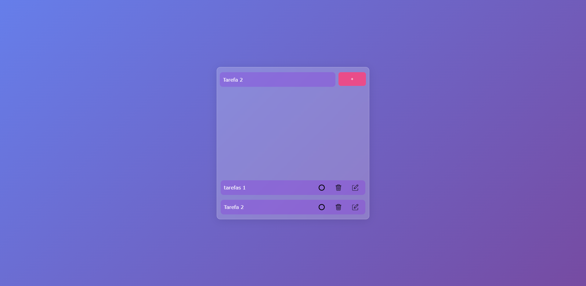

<h1 align="center"> Todo com ReactJs 💻 </h1>

## Briefing 📄

Um todo básico construído com ReactJs. As features permitem adicionar, marcar como feita, excluir ou editar a tarefa.

> [Acessar](https://reactodojs.netlify.app)

<h2 align="left"> Objetivo 📌 </h2>

- Fazer o meu primeiro contato com ReactJs.

---

<h3 align="center"> Home 📷 </h3>

<h3 align="center"> Tecnologias utilizadas 🤖 </h3>

> 

